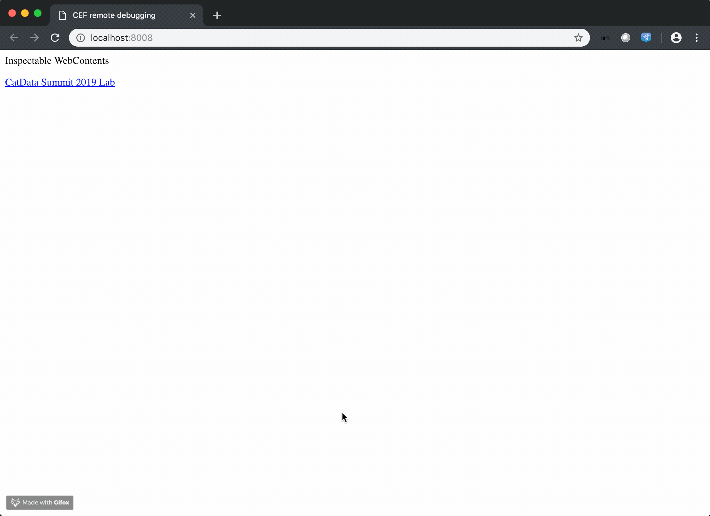

# Create an AEM Custom Metadata panel in Creative Cloud apps in 90 minutes!

Want to make a desktop version of your Adobe Experience Manager metadata schemas for your Creative Cloud users? Now you can, with Adobe’s Common Extensibility Platform. CEP is an HTML and NodeJS based extensibility platform that’s both powerful and easy to use. CEP extensions can interact with documents and web services, enabling robust enterprise use cases for creative users. Unlike C++ extensions, CEP extensions are cross-platform and cross-version, making maintenance a breeze. You can also deploy CEP extensions using the CC Packager or command-line tools.

## Table of Contents

* [Lab Overview](#lab-overview)
* [Lesson 1 - Get started with CEP](#Lesson-1---Get-started-with-CEP)
* [Lesson 2 - JSX Startup Script](#Lesson-2---JSX-Startup-Script)
* [Lesson 3 - XMP SDK in JSX](#Lesson-3---XMP-SDK-in-JSX)
* [Lesson 4 - Bridge the gap between CEP & JSX](#Lesson-4---Bridge-the-gap-between-CEP-&-JSX)
* [Lesson 5 - Display XMP Metadata](#Lesson-5---Display-XMP-Metadata)
* [Lesson 6 - CEP Debugging](#Lesson-6---CEP-Debugging)
* [CEP Package, Distribute, Install](https://github.com/Adobe-CEP/Getting-Started-guides/tree/master/Package%20Distribute%20Install)
* [Useful Resources](#useful-resources)

## Lab Overview

This lab will provide you with an introduction to the structure of a CEP extension. At the conclusion of the lab, you will have a fully functional extension that works in Adobe Bridge. This extension will allow the end user to both read and change specific metadata on an asset, some of which will have been applied by AEM Assets. You will also understand how to code against the XMP libraries that underpin metadata in Creative Cloud desktop applications and AEM.

### Key Takeaways

* Discover resources and examples for working with CEP
* Learn best practices for building CC extensions with CEP
* Build and deploy a custom metadata panel

### Prerequisites

Working knowledge of:
* Adobe Bridge 2018/2019
* Text Editor (VSCode)
* Google Chrome Browser

### Environment Setup

1. Copy CatData_Summit_Lab in resources/todo_lab to Applications -> Adobe Bridge 2019 -> CEP -> extensions

## Lesson 1 - Get started with CEP

### Objective

1. Review basic CEP folders structure and required files.
2. Complete Manifest.xml
    * Modify ExtensionID, HostList and DispatchInfo

### Lesson Context

We will go over folders structure of a CEP project and the CEP extension manifest.xml.

#### Exercise 1

1. Open ../CatData_Summit_Lab/CSXS/Manifest.xml

2. Give your CEP Extension a unique identifier by modifying ```ExtensionBundleId```.
    ```xml
    <ExtensionManifest xmlns:xsi="http://www.w3.org/2001/XMLSchema-instance" ExtensionBundleId="com.adobe.summit19.cepmetadata" ExtensionBundleVersion="1.0" Version="9.0">
    ```
3. We must specify a list of available panel(s) by their extension ID in the ```ExtensionList``` section.
    ```xml
    <ExtensionList>
        <Extension Id="com.adobe.summit19.cepmetadata.main" Version="1.0"/>
    </ExtensionList>
    ```

4. Next, we define supported Adobe application and its version for this CEP extension. Each desktop application is a "host," and each has its own code and version targets. For our lab, we enable this extension on Adobe Bridge 2018 and up.
    ```xml
    <HostList>
        <Host Name="KBRG" Version="[8.0,99.9]"/>
    </HostList>
    ```
5. You define the required CEP runtime version for your target host application(s). For example, CEP Runtime version 9.0 can be run on Creative Cloud 2019 desktop apps.
    ```xml
    <RequiredRuntimeList>
        <RequiredRuntime Name="CSXS" Version="9.0"/>
    </RequiredRuntimeList>
    ```
6. Finally, we want to provide the manifest with all the panel's detail that is included within this extension. DispatchInfoList consists of individual panel information such as panel entry point, visibility, UI geometry, and etc.
Modify the following:
    * ```<MainPath>``` = Entry Point for HTML
    * ```<ScriptPath>``` = Path to JSX to be loaded at panel launch

    ```xml
    <Extension Id="com.adobe.summit19.cepmetadata.main">
        <DispatchInfo>
            <Resources>
                <MainPath>./client/index.html</MainPath>
                <ScriptPath>./host/XMP.jsx</ScriptPath>
                <CEFCommandLine></CEFCommandLine>
            </Resources>
            <Lifecycle>
                <AutoVisible>true</AutoVisible>
            </Lifecycle>
            <UI>
                <Type>Embedded</Type>
                <Menu>Summit 2019 CEP Lab</Menu>
                <Geometry>
                    <Size>
                        <Height>580</Height>
                        <Width>334</Width>
                    </Size>
                    <MaxSize>
                        <Height>800</Height>
                        <Width>1200</Width>
                    </MaxSize>
                    <MinSize>
                        <Height>400</Height>
                        <Width>600</Width>
                    </MinSize>
                </Geometry>
            </UI>
        </DispatchInfo>
    </Extension>
    ```
## Lesson 2 - JSX Startup Script

### Objective
1. Review Bridge_SelectionEvent JSX script.
2. Create Event Listener in CEP to receive dispatched event from JSX.
3. Enable startup script in Adobe Bridge.

### Lesson Context
In order to communicate with the Bridge application, we must enable a startup JSX script. This script will notify our CEP panel when the thumbnail selection event is detected within Adobe Bridge.

#### Exercise 2

1. Open Adobe Bridge 2019 -> Preferences -> Startup Scripts

2. Click Reveal My Startup Script
    

3. Copy "Bridge_SelectionEvent" in ../CatData_Summit_Lab/host/startup to the startup script folder

4. Quit Adobe Bridge

5. Open ../CatData_Summit_Lab/client/js/index.js in text editor

6. Create an event listener to detect dispatched event from JSX. We will use the CSInterface library to add an EventListener with event id "cep.extendscript.event.selectedEvent" when index.html loaded.
    * Go to the following line ```$(document).ready(() => {...}``` and add the following code
    ```javascript
    csInterface.addEventListener("cep.extendscript.event.selectedEvent", (event) => {
        let filename = event.data;
        if (_.isEmpty(filename) === false) {
            currentFilename = filename;
            alert(`file selected: ${currentFilename}`);
        }
    });
    ```
7. Open Adobe Bridge and Launch CEP Extension to test thumbnail selection event.
    * Windows -> Extensions -> Summit 2019 CEP Lab

8. Select a thumbnail in Adobe Bridge Content window to verify event selection startup script.
    

## Lesson 3 - XMP SDK in JSX

### Objective

1. Complete XMPAdapter Class in XMP.jsx
    * Import XMP SDK Library
    * Complete XMPAdapter methods
        * Complete TODO items in ```XMPAdapter.prototype.open```
        * Complete TODO items in ```XMPAdapter.prototype.get```
        * Review ```getArrayItems = function(namespace, property){...}```
        * Review ```getStructObj = function(namespace, property){...}```
        * Complete TODO items in ```XMPAdapter.prototype.set```
        * Complete TODO items in ```XMPAdapter.prototype.commit```
        * Complete TODO items in ```XMPAdapter.prototype.close```

### Lesson Context

We will explore XMP Toolkit SDK to retrieve and modify XMP MetaData.

#### Exercise 3

1. In Text Editor, open ../host/XMP.jsx

2. We need to load AdobeXMPScript library by instantiating the ExternalObject class.

    ```javascript
    if(xmpLib == undefined){
        var xmpLib = new ExternalObject("lib:AdobeXMPScript");
    }
    ```

3. ```XMPAdapter.prototype.open```
    *  First, we must open the file by instantiating XMPFile object. This class corresponds to the Adobe XMP Toolkit’s File Handler component, which provides convenient I/O access to the main, or document level, XMP for a file. For ```getXMP(...)``` function, we want to open a file for modify access.

        ```javascript
        xmpFile = new XMPFile(filename, XMPConst.UNKNOWN, XMPConst.OPEN_FOR_UPDATE);
        ```

    * Once we open a file to retrieve XMP MetaData, we must call ```getXMP()``` method from ```XMPFile``` object. This method returns an ```XMPMeta``` object. ```XMPMeta``` class provides the ability to create and query metadata properties from an XMP namespace. The class also provides static functions that allow you to create and query namespaces and aliases.

        ```javascript
        xmpMeta = xmpFile.getXMP();
        ```

4. ```XMPAdapter.prototype.get```
    * ```get(...)``` method is a sequence of logic that help retrieve the value of a property within XMP. We need to verify if the property exists and identify what type of property it is. If it is an array, it need to retrieve the value of each item in the collection.
        + We must first call ```getProperty(...)``` method in ```XMPMeta``` object, and this return ```XMPProperty``` object. ```XMPProperty``` contains only read-only properties that describe a metadata property. We can identify property type by 'options' property.

        ```javascript
        var prop = xmpMeta.getProperty(namespace, property);
        if(prop !== undefined){
            //Check if property value is an array
            if(prop.options & XMPConst.PROP_IS_ARRAY){
                var items = getArrayItems(namespace, property);
                return items;
            }else{
                return prop.toString();
            }
        }
        ```
5. ```getArrayItems = function(namespace, property){...}```
    * If the property is an array, we have to do the following:
        + Using ```countArrayItems(...)``` method in ```XMPMeta``` object, we can determine the number of items in the collection and loop through it.
        + To retrieve an array item, we must call ```getArrayItem(...)``` and pass namespace, property, and index.
        **Note: index of an array starts at 1, not 0.**
        + For an array item that is a structure (STRUCT) type, we must handle it differently by calling ```getStructObj(...)``` function.

        ```javascript
        var cnt = xmpMeta.countArrayItems(namespace, property);
        var objArr = [];
        if (cnt > 0){
            for(var i=1;i <= cnt;i++){
                arrItem = xmpMeta.getArrayItem(namespace, property, i);
                if (arrItem && arrItem.options & XMPConst.PROP_IS_STRUCT){
                    var obj = getStructObj(namespace, property + "[" + i + "]")
                    objArr.push(obj);
                }else{
                    objArr.push(arrItem.toString());
                }
            }
            return objArr;
        }
        ```
7. ```getStructObj = function(namespace, property){...}```
    * If the property within an array is a structure, then we must construct an object.
        + Using ```iterator(...)``` method in ```XMPMeta``` object, we can iterate through the nested object of the given property within a namespace.
        + Calling ```next()``` method to retrieve the next item in an iterator. This returns ```XMPProperty``` object.

        ```javascript
        var obj = {},
            iter = xmpMeta.iterator(XMPConst.JUST_CHILDREN,namespace,property),
            item = iter.next();
        while(item){
            if (item.value){
                var propertyName = (item.path).match(/(\w+)$/g)[0]
                if(item.options & XMPConst.PROP_IS_ARRAY){
                    obj[propertyName] = getArrayItems(namespace, propertyName);
                }else{
                    obj[propertyName] = item.value;
                }
            }
            item = iter.next()
        }
        return obj;
        ```

8. ```XMPAdapter.prototype.set```
    * ```set(...)``` method is a sequence of logic that help set a value of a XMP property. If you have a custom namespace or a namespace that not registered in the file XMP Metadata, a namespace must be registered before continuing.

    ```javascript
    XMPMeta.registerNamespace(namespace, prefix);
    ```

    * If a value is an Array, we must either delete the current property or append a value to it. For the simplicity, we overwrite the existing array property with a new array.
        * To overwrite, we delete the existing property using ```deleteProperty()``` method in ```XMPMeta``` object.
        * Next, we create an empty property with a type of Array using ```setProperty(...)``` method.
        * Finally, we loop through the value and utilize ```appendArrayItem(...)``` method to append each item to the array.

    ```javascript
    if(Object.prototype.toString.call(value) === '[object Array]'){
        if(xmpMeta.doesPropertyExist(namespace, property)){
            xmpMeta.deleteProperty(namespace, property);
        }
        //Create Empty Property with Array Type
        xmpMeta.setProperty(namespace, property, null, XMPConst.PROP_IS_ARRAY);
        //Append Array Items to the Property
        for(var i = 0;i<value.length;i++){
            xmpMeta.appendArrayItem(namespace, property, value[i]);
        }
    }else{...}
    ```

    * If a value is a string then we can pass a value to ```setProperty(...)``` method.
    ```javascript
    xmpMeta.setProperty(namespace, property, value);
    ```
9. ```XMPAdapter.prototype.commit```
    * Since we know how to write XMP, we must commit the change that we made. To commit the change, we must call ```putXMP(...)``` from XMPFile object and pass modified xmpMeta back in.
    ```javascript
    if(xmpFile && xmpMeta){
        //commit the change, save back XMPMeta.
        xmpFile.putXMP(xmpMeta);
    }
    ```
    * Note: ```putXMP(...)``` does not write the modified metadata back into the file. We must close the opened XMPFile to finalize the change.

10. ```XMPAdapter.prototype.close```
    * Close an opened file by calling ```closeFile()``` from XMPFile object.
    ```javascript
    if(xmpFile){
        //close
        xmpFile.closeFile();
        xmpFile = undefined;
        xmpMeta = undefined;
    }
    ```

## Lesson 4 - Bridge the gap between CEP & JSX

### Objective

1. Create functions in JSX for get/set XMP from CEP
2. Call JSX get/set XMP functions from CEP
3. Review code on how to display retrieved XMP Metadata from JSX.

### Lesson Context

We will look at how to get/set XMP metadata from our custom ```XMPAdapter``` to CEP.

#### Exercise 4

1. Open ../host/XMP.jsx
2. In the previous lab, we created ```XMPAdapter``` class to simplify the way we retrieve XMP data. In this step, we will need a way for CEP to be able to retrieve XMP metadata.
    * First, we need to pass an object from CEP to ```XMPCEPHelper.getXMP(...)``` function.
        * The object for the parameter should contain the current filename, namespace URL, and property name
    * Next, we create new ```XMPAdapter``` object, open the file, and retrieve property value within the specified property in a namespace.
    * If there is a value, we need to return ```JSON.stringify``` of the result.

    ```javascript
    XMPCEPHelper.getXMP = function (args) {
        var filename = args.filename,
            namespace = args.namespace,
            property = args.property;
        var xmp = new XMPAdapter();
        xmp.open(filename);
        var result = xmp.get(namespace, property);
        xmp.close();
        if (result !== undefined) {
            return JSON.stringify(result);
        }
    }
    ```
3. We do a similar method for setting XMP data from CEP.
    * To set XMP, we require additional information such as a prefix and a value.
    * Create new XMPAdapter object, open the current file and call ```set``` method.
    ```javascript
    XMPCEPHelper.setXMP = function (args) {
        var filename = args.filename,
            namespace = args.namespace,
            prefix = args.prefix,
            property = args.property,
            value = args.value;

        var xmp = new XMPAdapter();
        xmp.open(filename);
        xmp.set(namespace, prefix, property, value);
        xmp.commit();
        xmp.close();
    }
    ```
4. Lets call ```XMPCEPHelper.getXMP(...)``` in JSX from CEP.
    * By invoking ```getXMPfromJSX(...)``` function, we need to pass an object that contains the following keys
        * filename
        * namespace
        * property
    * Next, we serialize this object for JSX by ```JSON.stringify``` the ```paramObj```.
    * Using our helper function ```JSXHelper.runEvalScript(...)```, we will evaluate ```XMPCEPHelper.getXMP(paramObj)```  in JSX

    ```javascript
    function getXMPfromJSX(paramObj) {
        paramObj = JSON.stringify(paramObj);
        return JSXHelper.runEvalScript(`XMPCEPHelper.getXMP(${paramObj})`);
    }
    ```
 5. Lets call ```XMPCEPHelper.setXMP(...)``` in JSX from CEP.
    * By invoking ```setXMPfromJSX(...)``` function, we need to pass an object that contains the following keys
        * filename
        * namespace
        * prefix
        * property
        * value
    * Next, we serialize this object for JSX by ```JSON.stringify``` the ```paramObj```.
    * use helper function ```JSXHelper.runEvalScript(...)``` to evaluate ```XMPCEPHelper.setXMP(paramObj)```  in JSX
    ```javascript
    function setXMPfromJSX(paramObj) {
        paramObj = JSON.stringify(paramObj);
        return JSXHelper.runEvalScript(`XMPCEPHelper.setXMP(${paramObj})`);
    }
    ```

## Lesson 5 - Display and Edit XMP Metadata

### Objective

1. Review Metadata Display

### Lesson Context

We will review how to display the XMP Metadata to the panel.

#### Exercise 5

1. Open ../client/index.jsx

2. In lesson 2, we added event handling to listen for a selection event by JSX startup script. When the CEP extension received the dispatched event, it will need to retrieve and populate XMP data to our UI by calling ```populateXMPFields()``` function.

    ```javascript
    csInterface.addEventListener("cep.extendscript.event.selectedEvent", (event) => {
        let filename = event.data;
        if (_.isEmpty(filename) === false) {
            currentFilename = filename;
            populateXMPFields();
        }
    });
    ```
3. In ```populateXMPFields()``` function, We will begin populating the editable fields (Name, Cat Breed, Age, and Gender).
    

    * First, we created a list that map the form elements to XMP property.
    ```javascript
    const uiFields = [{
            "fieldID": "cat_name",
            "namespace": "http://cat.adobe.com",
            "prefix": "cat",
            "property": "name"
        },
        {
            "fieldID": "cat_breed",
            "namespace": "http://cat.adobe.com",
            "prefix": "cat",
            "property": "breed"
        },
        {
            "fieldID": "cat_age",
            "namespace": "http://cat.adobe.com",
            "prefix": "cat",
            "property": "age"
        },
        {
            "fieldID": "cat_gender",
            "namespace": "http://cat.adobe.com",
            "prefix": "cat",
            "property": "gender"
        }
    ];
    ```
    * Next, To save ourself from writing repetitive code, we will simply iterate through each of the items in the list. We are going to call ```getXMPfromJSX(...)``` and pass the corresponding XMP namespace and the property name.

    ```javascript
    for (let field of uiFields) {
        let params = {
            filename: currentFilename,
            namespace: field.namespace,
            property: field.property
        }
        getXMPfromJSX(params).then(result => {
            if (_.isEmpty(result) === false) {
                $(`#${field.fieldID}`).val(JSON.parse(result));
            } else {
                $(`#${field.fieldID}`).val("");
            }
        })
    }
    ```
4. For our extension, we wanted to populate geotagging information by pulling GPS data from the EXIF namespace to a map.
    

    * EXIF stored GPS coordinate in Degrees Decimal Minutes (DDM) format and we need to convert it to Decimal Degrees (DD)format by calling our ```MapHelper.convertDDMtoDD(...)``` function (See ./client/js/utils.js).

    * Once we have the correct format for the coordinate, we can use Leaflet library to draw the map and pin.

    ```javascript
    // Get Latitude and Longitude from EXIF GPS Data
    let gpsLat = getXMPfromJSX({
        filename: currentFilename,
        namespace: "http://ns.adobe.com/exif/1.0/",
        property: "GPSLatitude"
    });

    let gpsLong = getXMPfromJSX({
        filename: currentFilename,
        namespace: "http://ns.adobe.com/exif/1.0/",
        property: "GPSLongitude"
    });

    Promise.all([gpsLat,gpsLong]).then(results => {
        if (!_.isEmpty(results) && results.length == 2) {
            let ddLat = MapHelper.convertDDMtoDD(JSON.parse(results[0])),
                ddLong = MapHelper.convertDDMtoDD(JSON.parse(results[1]));
            console.log(`Lat: ${ddLat} | Long: ${ddLong}`);
            MapHelper.setLeafletMap('mapid', ddLat, ddLong, true);
        }
    });
    ```

5. Lastly, we will be displaying top 10 DAM PredictedTag generated by AEM.
    

    ```javascript
    //get predictedTags from DAM namespace
    getXMPfromJSX({
        filename: currentFilename,
        namespace: "http://www.day.com/dam/1.0",
        property: "predictedTags"
    }).then(result => {
        if (_.isEmpty(result) === false) {
            //get the first 10 predicted tags
            let tags = JSON.parse(result).slice(0, 10)
            for (let tag of tags) {
                $("#predictedTags").val($("#predictedTags").val() + `${tag.predictedTagName} - ${(tag.predictedTagConfidence * 100).toFixed(2)}%\n`);
            }
        } else {
            $("#predictedTags").val("");
        }
    });
    ```
6. Since we made a couple of fields editable, we want the end user to press Save to call the ```save()``` function.
    * Similar to retrieve Name, Cat Breed, Age and Gender fields in step 3, we will call ```setXMPfromJSX(...)``` and pass it the corresponding XMP namespace, property name, prefix and field value.
    ```javascript
    function save() {
        if (!_.isEmpty(currentFilename)) {
            for (let field of uiFields) {
                let value = $(`#${field.fieldID}`).val();
                if (_.isEmpty(value) === false) {
                    let params = {
                        filename: currentFilename,
                        namespace: field.namespace,
                        prefix: field.prefix,
                        property: field.property,
                        value: value
                    }
                    setXMPfromJSX(params);
                }
            }
        }
    }
    ```

## Lesson 6 - CEP Debugging

### Objective

1. Enable Debug mode and Allow unsigned extension
2. Create .debug file
3. Using Google Chrome Browser - Developer Tools to debug CEP.

### Lesson Context

We will go through the process of debugging CEP extension with Google Chrome Developer Tool.

#### Exercise 6
1. By default, debug mode and allowing unsigned extension is disabled. To enable we must do the following.
    * #### macOS
        * Open Terminal and input the following command:
            ```defaults write com.adobe.CSXS.9 PlayerDebugMode 1```
        * Reboot your machine.
    * #### Windows
        * Open Registry Edit and Navigate to the following location
            ```HKEY_CURRENT_USER/Software/Adobe/CSXS.9```
        * If you do not see CSXS.9 folder, you can create a new one.
        * Add the following String type key
            * ```PlayerDebugMode``` with a value of ```1```

2. Create a new file called ```.debug``` in the root of CEP extension
    * Extension Id must match the extension Id that we input in Lesson 1.3.
        * If the extension have multiple panel then you must specify each of the extension id here
    * HostList is a list of supported application for your panel. Each Host Name have a corresponding port that will be use for debugging.

    ```xml
    <?xml version="1.0" encoding="UTF-8"?>
    <ExtensionList>
        <Extension Id="com.adobe.summit19.cepmetadata.main">
            <HostList>
                <Host Name="PHXS" Port="8000"/>
                <Host Name="IDSN" Port="8001"/>
                <Host Name="AICY" Port="8002"/>
                <Host Name="ILST" Port="8003"/>
                <Host Name="PPRO" Port="8004"/>
                <Host Name="PRLD" Port="8005"/>
                <Host Name="FLPR" Port="8006"/>
                <Host Name="AUDT" Port="8007"/>
                <Host Name="KBRG" Port="8008"/>
            </HostList>
        </Extension>
    </ExtensionList>
    ```

3. To debug, we need to launch the Adobe Bridge 2019 and our CEP panel then with Google Chrome browser navigate to the following URL:  ```http://localhost:8008```
    

4. To add a debug breakpoint use ```debugger``` keyword and place it within your javascript to tell the debugger where to stop. This will allow you to step through the code.


## Useful Resources

[Getting Started with CEP Extensions](https://github.com/Adobe-CEP/Getting-Started-guides)

[CEP Debugging](https://github.com/Adobe-CEP/Getting-Started-guides/tree/master/Client-side%20Debugging)

[CEP Package, Distribute, Install](https://github.com/Adobe-CEP/Getting-Started-guides/tree/master/Package%20Distribute%20Install)

[Adobe Bridge CEP Cookbook](https://github.com/Adobe-CEP/CEP-Resources/raw/master/Documentation/Bridge/CEP_9_Extensions_Cookbook_Bridge.pdf)

[Using ES6 promises to write async “evalScript()” calls](https://medium.com/adobetech/using-es6-promises-to-write-async-evalscript-calls-in-photoshop-2ce40f93bd8b)

[Scripting Access to XMP Metadata](http://estk.aenhancers.com/10%20-%20Scripting%20Access%20to%20XMP%20Metadata/index.html)

[XMP Developer Center](https://www.adobe.com/devnet/xmp.html)
